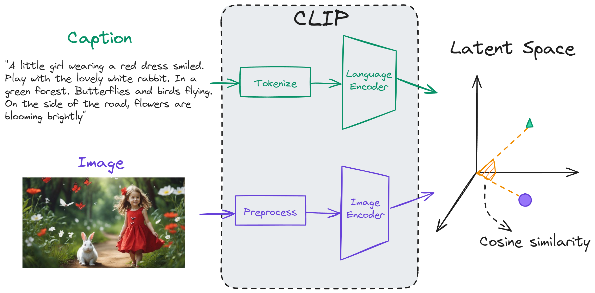

# Solution for the AI Team Challenge

For this challenge, we deployed [CLIP](https://openai.com/blog/clip/). CLIP (Contrastive Language-Image Pre-Training) is a deep learning model that is trained on a variety of image-caption pairs. CLIP has both an image encoder and a language encoder. As a result of its novel training process, CLIP is able to map texts and images to the same latent space.

## Approach

We used CLIP to map the images and their corresponding captions to the same latent space and utilized cosine similarity to measure the similarity between the image and caption embeddings in the latent space. Figure shows our pipeline more clearly. 




## Usage

We installed [PyTorch 1.8.1](https://pytorch.org/get-started/locally/), torchvision, as well as other additional dependencies as shown below. Then CLIP was installed as a Python package. The commands for installing the above packages on a CUDA GPU machine are as follows:

```bash
$ conda create -n clip_env  -c conda-forge -c nvidia python=3.10 cuda-version=11.2 pytorch torchvision
$ pip install ftfy regex tqdm pandas
$ pip install git+https://github.com/openai/CLIP.git
```

Replace `cudatoolkit=11.2` above with the appropriate CUDA version on your machine or `cpuonly` when installing on a machine without a GPU.

To run the code, activate the created ```clip_env``` venv and run the ```main.py``` python file. At the conclusion of the file's execution, the following outputs are generated:

- ```output.csv```: This file is a copy of the provided in CSV file with an additional column showing similarity of the image-caption pair.
- ```image_captions.jpg```: This figure visualises each image-caption pair and their measured similarity. 
- ```similarity_matrix.jpg```: This figure shows similarity between all possible image-caption pairs in the input CSV file.  

These figures are provided below for the reader's conveniece. The first figure shows each image, its corresponding caption and the measured cosine similarity between the pair. 


The second image displays the calculated cosine similarity between all potential pairs of images and captions contained within the input CSV file.


## System Specification
A workstation with the following specifications was used to run the code: 

<div style="margin-left: auto;
            margin-right: auto;
            width: 50%">

| GPU | GPU Memory (GiB)| vCPUs | Memory (GiB)|
| :-------: | :-------: | :-------: | :-------: |
| 1	| 24 |	8 |	32 |
</div>

## Resource Usage


