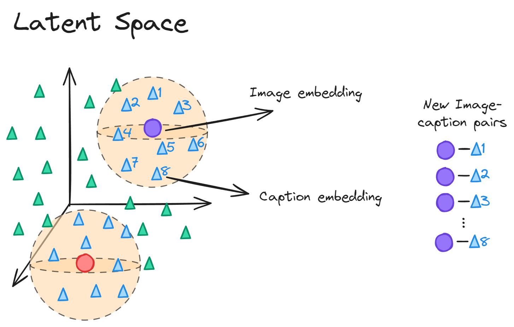

# Solution for the AI Team Challenge

For this challenge, we deployed [CLIP](https://openai.com/blog/clip/). CLIP (Contrastive Language-Image Pre-Training) is a deep learning model that is trained on a variety of image-caption pairs. CLIP has both an image encoder and a language encoder. As a result of its novel training process, CLIP is able to map texts and images to the same latent space.

## Approach

We used CLIP to map the images and their corresponding captions to the same latent space and utilized cosine similarity to measure the similarity between the image and caption embeddings in the latent space. Figure shows our pipeline more clearly. 


## Usage

We installed [PyTorch 1.8.1](https://pytorch.org/get-started/locally/), torchvision, as well as other additional dependencies as shown below. Then CLIP was installed as a Python package. The commands for installing the above packages on a CUDA GPU machine are as follows:

```bash
$ conda create -n clip_env  -c conda-forge -c nvidia python=3.10 cuda-version=11.2 pytorch torchvision
$ pip install ftfy regex tqdm pandas
$ pip install git+https://github.com/openai/CLIP.git
```

Replace `cudatoolkit=11.2` above with the appropriate CUDA version on your machine or `cpuonly` when installing on a machine without a GPU.

To run the code, activate the created ```clip_env``` venv and run the ```main.py``` python file. At the conclusion of the file's execution, the following outputs are generated:

- ```output.csv```: This file is a copy of the provided in CSV file with an additional column showing similarity of the image-caption pair.
- ```image_captions.jpg```: This figure visualises each image-caption pair and their measured similarity. 
- ```similarity_matrix.jpg```: This figure shows similarity between all possible image-caption pairs in the input CSV file.  

These figures are provided below for the reader's conveniece. The first figure shows each image, its corresponding caption and the measured cosine similarity between the image-caption pair. 


The second image displays the calculated cosine similarity between all potential pairs of images and captions contained within the input CSV file.


## System Specification
A workstation with the following specifications was used to run the code: 

<table   align="center" style="margin-left: auto; margin-right: auto;">
  <tr><th>GPU</th>           <th>GPU Memory (GiB)</th>      <th>vCPUs</th>  <th>Memory (GiB)</th></tr>
  <tr><td>1 </td>   <td>24</td>       <td>8</td>          <td>32</td></tr>
</table>

## Resource Usage

Using the above workstation, below is a summary of the code's time and memory usage:
<table   align="center" style="margin-left: auto; margin-right: auto;">
  <tr><th>Time (Seconds)</th>           <th>Memory (GB)</th></tr>
  <tr><td>4.90 </td>   <td>3.48</td></tr>
</table>

## Optimization for Large-scale Inference

Multiple approaches can be taken to improve the speed and memory requirements for large-scale inference tasks. These include:

- **Distributed and Parallel Computing:** there exists multiple pytorch packages that faciliate parallel and distributed programming on CPUs and GPUs. Examples of these packages include ```torch.distributed``` which allows distributing the inference tasks on multiple machines, ```torch.nn.parallel``` that allows parallelising a process on GPUs on the same machine and ```torch.utils.data.DataLoader``` that allows efficient data processing and batching using multiple CPUs. These packages help improve inference speed. 
- **Model Quantization:** Here we are referring to post-training quantization where the weights and activations of the trained model are quantized to lower prediction after the training process. Pytorch packages such as ```torch.quantization.quantize_static``` and ```torch.quantization.quantize_dynamic``` reduce precision of model parameters which can lead to reduced memory footprints and faster inference. 
- **Model Pruning and Distillation:** These are techniques that aim to reduce the size of the trained model without significantly impacting its performance. Model pruning selectively removes parameters and connections that contribute minimally to the model's performance. Model distillation is a technique where a student (smaller) model is trained to mimic the behavior of the teacher (larger) model. Both techniques allow for faster inference while maintaining accuracy. 

## How This Helps with Curating Data for Text-to-Image Model Training
By leveraging the text and image embeddings mapped in the latent space, it becomes possible to generate new image-text pairs based on the proximity of each image embedding. Text embeddings closely associated with each image embedding can serve as suitable captions for the respective images. Furthermore, this method facilitates the discovery of new images corresponding to each caption. In essence, CLIP offers a pathway to data augmentation by generating additional image-caption pairs. The process is visually explained in the image below: 




